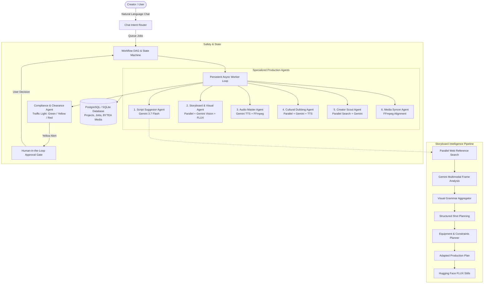

# 🎬 CreatorCrew

### An AI-native, multi-agent production studio for creators

[](https://creatorcrew3.vercel.app/)
[](https://creatorcrew.onrender.com/docs)
[](https://python.org)
[](https://nextjs.org)

**CreatorCrew** is an end-to-end AI video production platform that transforms a creator's natural-language idea into a coordinated, multi-stage production workflow.

Instead of forcing creators to manually switch between disconnected tools for scripting, web research, visual reference extraction, storyboarding, production constraint planning, voice generation, multilingual dubbing, media uploads, and compliance clearance, CreatorCrew orchestrates specialized AI agents through a shared, stateful project workflow.

The result is a single unified production workspace where creators can move from **idea → script → visual research → storyboard → production planning → audio → dubbing → final assets** using natural-language instructions.

---

## 🔗 Quick Links

* 🌐 **Live Web Application:** [https://creatorcrew3.vercel.app/](https://creatorcrew3.vercel.app/)
* 🎥 **Video Walkthrough:** [Demo Video Link](#)
* 📖 **Backend Technical Reference:** [backend/API_REFERENCE.md](backend/API_REFERENCE.md)
* 👥 **Team:** Atharva Deokar, Mayank Chauhan, Asmiya Sayyad, Saur Deshmukh

---

## 🚨 The Problem

Modern generative AI has made individual creative tasks accessible, but the actual video production workflow remains deeply fragmented.

A creator today typically must:

1. **Draft a script** using an isolated LLM chat interface.
2. **Search the web and video platforms** separately for visual references and mood boards.
3. **Manually inspect references** to determine camera angles, lighting schemes, and visual grammar.
4. **Build a storyboard** from scratch without real-world equipment awareness.
5. **Estimate gear feasibility** manually (e.g. *"Can I shoot this on a smartphone with a tripod as a solo creator?"*).
6. **Generate voiceovers** on a separate TTS portal with rigid timing.
7. **Translate and dub content** using third-party localization tools that miss cultural nuance.
8. **Verify copyright and compliance** risks (brand logos, music, likeness rights) manually.
9. **Coordinate state by hand**—tracking which assets are ready and which downstream stages are blocked.

The fundamental issue is not generation quality—**the problem is coordination**.

There has been no production intelligence layer that connects real-time web intelligence, multimodal reasoning, production constraint solvers, and deterministic media tooling into one cohesive system.

---

## 💡 Our Solution

CreatorCrew acts as an **AI-native production studio**.

Creators interact using natural language:

> *"Write a 3-beat script about a futuristic cyberpunk coffee brand."*

Then:

> *"Generate a storyboard based on cinematic sci-fi references."*

Then:

> *"Generate voiceover for this script."*

Or:

> *"Translate and dub the audio into Hindi with localized cultural framing."*

Behind the scenes, the **Orchestrator** interprets creator intent, evaluates the project's **Workflow DAG**, verifies dependencies and compliance checkpoints, and queues background jobs for specialized agents.

```
┌────────────────────────────────────────────────────────────────────────┐
│                        CREATOR NATURAL LANGUAGE                        │
└───────────────────────────────────┬────────────────────────────────────┘
                                    │
                                    ▼
┌────────────────────────────────────────────────────────────────────────┐
│                     INTENT ROUTER & WORKFLOW DAG                       │
│     (Evaluates State, Ready Stages, Dependencies & Guardrails)         │
└───────────────────────────────────┬────────────────────────────────────┘
                                    │
    ┌────────────────┬──────────────┼──────────────┬────────────────┐
    ▼                ▼              ▼              ▼                ▼
┌─────────┐    ┌───────────┐  ┌───────────┐  ┌───────────┐    ┌───────────┐
│ Script  │    │Storyboard │  │   Audio   │  │ Cultural  │    │Compliance │
│  Agent  │    │  Pipeline │  │   Agent   │  │ Dub Agent │    │   Agent   │
└────┬────┘    └─────┬─────┘  └─────┬─────┘  └─────┬─────┘    └─────┬─────┘
     │               │              │              │                │
     ▼               ▼              ▼              ▼                ▼
┌────────────────────────────────────────────────────────────────────────┐
│               SHARED DATABASE & STATE PERSISTENCE LAYER                │
│    (PostgreSQL / SQLite: Scripts, Shots, Binary Media, Approvals)      │
└────────────────────────────────────────────────────────────────────────┘
```

### Core Principle
> **Creators express intent. Agents execute the production workflow. Deterministic tools handle media operations.**

---

## 🧠 System Architecture & Multi-Agent Workflow



---

## 🤖 Deep Google Gemini Integration

Google Gemini powers the multimodal reasoning, structural parsing, visual analysis, and generation across the studio:

### 1. Structured Script Generation (`Gemini 3.7 Flash`)
Transforms open-ended creator concepts into production-ready schemas containing:
* Narrative structure, hooks, core beats, and timing estimates.
* Visual intent guidelines and audio mood descriptors.
* Validated Pydantic models consumed downstream by the storyboard and audio engines.

### 2. Multimodal Visual Reference Analysis (`Gemini Vision`)
Analyzes real-world video frames and reference images discovered during research to extract:
* **Camera decisions:** Shot size (extreme close-up to extreme wide), camera angle, pan/tilt/dolly movements.
* **Lighting & Color:** Key-to-fill ratios, color temperature, palette accents, high-contrast chiaroscuro.
* **Composition:** Subject placement, depth of field, leading lines, and background density.

### 3. Visual Grammar Synthesis
Aggregates reference findings into reusable stylistic rules (e.g. *"Centered low-angle framing, neon cyan accents on deep shadow, 2.39:1 anamorphic feel"*), ensuring shot-to-shot continuity.

### 4. Production Planning & Constraint Adaptation
Reasons over the creator's real-world equipment (e.g., smartphone vs. cinema rig, gimbal vs. tripod, solo operator vs. multi-crew) to translate ambitious cinematic shots into practical shooting steps without sacrificing creative vision.

### 5. AI Voiceover & Nuanced Pacing (`Gemini Flash TTS`)
Synthesizes speech segments with timing control, adjusting speech rate and emotion to align with the script beat durations.

---

## 🔎 Parallel: Live Web Intelligence for Production

LLMs alone lack real-time web awareness. CreatorCrew integrates **Parallel Web Systems** to ground creative agents in live external knowledge:

```
Script Beat Concept
       │
       ▼
Parallel Search API  ───► Discovers current cinematic references, ads & real-world videos
       │
       ▼
Parallel Extract API ───► Retrieves video URLs, metadata & visual assets
       │
       ▼
FFmpeg Preprocessing ───► Extracts representative keyframes
       │
       ▼
Gemini Vision        ───► Performs deep visual & compositional analysis
```

* **Live Reference Discovery:** Parallel searches live web and video sources for relevant creative references based on the script's theme.
* **Cultural Context Research:** During multilingual dubbing, Parallel investigates local idioms, regional colloquialisms, and sensitive cultural context before transcreation.
* **Compliance & Clearance Intelligence:** Parallel checks ownership, licensing terms, and fair-use boundaries for identified entities.

---

## ⚙️ The Specialized Agent Roster

| Agent | Responsibility | Core Tools & Models |
| :--- | :--- | :--- |
| **Script Suggestor** | Generates 3-act/3-beat structured narrative scripts with visual and audio intent. | Gemini 3.7 Flash, Pydantic |
| **Storyboard & Visual** | Conducts reference research, derives visual grammar, drafts shot lists, adapts to gear constraints, and generates keyframe stills. | Parallel Search/Extract, Gemini Vision, Hugging Face FLUX.1 |
| **Audio Master** | Produces timed voiceovers, cleans creator dialogue, and balances audio tracks. | Gemini TTS (`gemini-3.1-flash-tts-preview`), FFmpeg |
| **Cultural Dubbing** | Localizes speech into target languages (e.g., Hindi, Spanish, Japanese) with cultural transcreation. | Parallel Task/Monitor, Gemini, Gemini TTS |
| **Clearance / Compliance** | Evaluates scripts, visual assets, and audio for copyright, trademark, and safety risks. | Gemini Multimodal, Parallel Search, Clearance Rules |
| **Creator Scout** | Discovers brand deals, sponsors, and collaborative opportunities aligned with the creator's profile. | Parallel Search, Gemini Reasoning |
| **Media Syncer** | Calculates audio/video drift and aligns creator uploads with project timing. | FFmpeg, FFprobe |

---

## 🛡️ Human-in-the-Loop Compliance

Certain workflows require human oversight before proceeding:

* **GREEN:** Automated clearance passed; downstream stages execute automatically.
* **YELLOW (Advisory Checkpoint):** Potential brand risk, commercial ambiguity, or cultural sensitivity detected. The engine pauses downstream DAG execution and raises a checkpoint.
* **Human Approval Gate:** The creator reviews flagged issues in the UI and can approve, override, or edit the plan via `/projects/{id}/approve`.
* **RED (Hard Block):** Explicit violation detected; the action is rejected with actionable remediation advice.

---

## 🎯 Example End-to-End Creator Journey

1. **Project Initiation:**
   Creator inputs: *"Create a futuristic cyberpunk coffee brand ad with dark neon aesthetics."*
2. **Script Generation:**
   `ScriptAgent` generates a 3-beat script with hooks, pacing, and visual prompts.
3. **Reference Research & Visual Grammar:**
   `StoryboardAgent` queries **Parallel** for sci-fi coffee aesthetics, downloads reference frames, analyzes them with **Gemini Vision**, and builds a visual grammar guide.
4. **Storyboard & Equipment Adaptation:**
   The shot list is planned and adapted to the creator's equipment profile (`Smartphone + Tripod + Solo Creator`). **FLUX** generates keyframe stills for each beat.
5. **Voiceover Synthesis:**
   `AudioAgent` generates a timed voiceover track matching the script duration using **Gemini TTS**.
6. **Cultural Localization:**
   Creator requests: *"Translate the audio into Hindi."* `CulturalDubAgent` transcreates dialogue for regional impact and generates a localized audio track.
7. **Asset Delivery:**
   All assets (keyframes, audio masters, dub tracks, scripts) are persisted to the database and displayed in the studio dashboard.

---

## 🏗️ Technology Stack

```
┌────────────────────────────────────────────────────────────────────────┐
│ FRONTEND                                                               │
│ Next.js 14 (App Router) • React • Tailwind CSS • Lucide Icons          │
│ Same-Origin Streaming API Proxy (Eliminates CORS & Inlined Secrets)   │
└───────────────────────────────────┬────────────────────────────────────┘
                                    │ HTTP / JSON
                                    ▼
┌────────────────────────────────────────────────────────────────────────┐
│ BACKEND & ORCHESTRATION                                                │
│ FastAPI (Python 3.12) • Uvicorn • Pydantic v2 • Async Background Loop │
│ Workflow DAG Engine • Chat Intent Router                               │
└─────────────────┬─────────────────┬──────────────────┬─────────────────┘
                  │                 │                  │
                  ▼                 ▼                  ▼
┌──────────────────┐ ┌───────────────────────────┐ ┌─────────────────────┐
│ AI & REASONING   │ │ EXTERNAL TOOLS & MEDIA    │ │ PERSISTENCE         │
│ Google Gemini    │ │ Parallel Web Systems      │ │ PostgreSQL (Render) │
│ Gemini Vision    │ │ FFmpeg / FFprobe          │ │ SQLite (Local Dev)  │
│ Gemini TTS       │ │ Hugging Face FLUX.1       │ │ Binary BYTEA Storage│
└──────────────────┘ └───────────────────────────┘ └─────────────────────┘
```

---

## 🚀 Local Development Setup

### 1. Prerequisites
* Python 3.12+
* Node.js 18+ and npm
* FFmpeg installed and available on system `PATH`
* API Keys: Google Gemini, Parallel, Hugging Face

### 2. Environment Variables

Create `backend/.env`:
```env
# AI Models & Keys
GEMINI_API_KEY="your-gemini-api-key"
GEMINI_MODEL="gemini-3.7-flash"
TTS_MODEL="gemini-3.1-flash-tts-preview"

# Parallel Web Systems
PARALLEL_API_KEY="your-parallel-api-key"

# Hugging Face
HF_TOKEN="your-huggingface-token"
HF_IMAGE_MODEL="black-forest-labs/FLUX.1-schnell"

# Database (Leave blank for local SQLite fallback)
DATABASE_URL=""
```

### 3. Running Backend

```bash
cd backend
python -m venv venv
# Windows:
.\venv\Scripts\activate
# Linux/macOS:
source venv/bin/activate

pip install -r requirements.txt
uvicorn app.main:app --reload --port 8000
```
Swagger API docs available at: `http://localhost:8000/docs`

### 4. Running Frontend

```bash
cd frontend
npm install
npm run dev
```
Open `http://localhost:3000` in your browser.

---

## 🧪 Testing

Run backend unit and integration tests:

```bash
cd backend
pytest tests/
```

---

## 👥 Meet the Team

* **Atharva Deokar**
* **Mayank Chauhan**
* **Asmiya Sayyad**
* **Saur Deshmukh**

---
